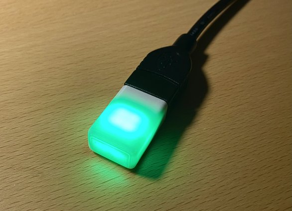

# Neo Trinkey Status Light

This is a small [CircuitPython](https://circuitpython.org/) firmware for the [Adafruit Neo Trinkey](https://www.adafruit.com/product/4870) that converts it to a USB controlled status light.



## Firmware Installation

- Follow the [CircuitPython install guide](https://learn.adafruit.com/welcome-to-circuitpython/installing-circuitpython) if your board does not have CircuitPython installed.
- Copy the `boot.py` and `code.py` files from the `firmware` directory to the `CIRCUITPY` drive.
- Unplug and replug the device (only required after first install of when `boot.py` has changed).

## Python Library Installation

The `neostatus` directory contains a Python module to control the status light. It can be installed with pip using:

``` console
pip install --upgrade https://github.com/jledet/neostatus/tarball/master
```

A demo animation can be run using:

``` console
python -m neostatus
```
